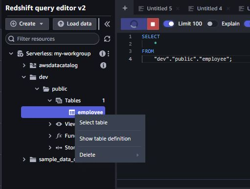

# INCREMENTAL DATA LOADING FROM AWS S3 BUCKET TO REDSHIFT BY USING AWS GLUE ETL JOB


# Scenario 

- Imagine you're tasked with managing a database or service that requires daily backups for data integrity and disaster recovery. To achieve this, you've implemented a solution where incremental backups are generated in the form of raw CSV files and stored in an Amazon S3 bucket.

- However, the challenge arises when you need to efficiently load this incremental data into an AWS Redshift data warehouse without duplicating records. Simply rewriting the entire database isn't an option, as it's resource-intensive and time-consuming. Instead, you need a method that seamlessly integrates the new data while maintaining an exact mapping.


# Overview
- This project aims to automate the `incremental data loading process` from an `Amazon S3` bucket to an `AWS Redshift cluster` using `AWS Glue ETL` (Extract, Transform, Load) jobs. The incremental loading strategy ensures that only new or modified data is transferred, optimizing performance and reducing redundancy.


# Project Steps
| Steps | Task  | Why we need?  | Description
| ---   | :---  | ---           | :---            |
| 1   | S3 Bucket Creation  | Data Source Setup           | Set up an S3 bucket as the source for data ingestion into Redshift.            |
| 2   | Redshift Cluster Configuration  | Data Warehouse Setup           | Configure a Redshift cluster, including creation of workgroups and namespaces, to organize and manage data effectively.            |
| 3   | IAM Role Creation  | Access Control           | Create an IAM role to grant AWS Glue the necessary permissions to access and manipulate S3 and Redshift resources securely.            |
| 4| Glue Configuration  | ETL Automation           | Configure AWS Glue components:            |
|    |   |            |             |


# Terms

- ``Incremental Data Load ``: A data loading process where only the new or modified data since the last load is transferred from the source to the destination. This approach minimizes data transfer overhead and ensures that only relevant data is updated or inserted, optimizing performance and reducing redundancy. [For more info](https://hevodata.com/learn/etl-incremental/)


- `Data Warehouse` : A centralized repository that stores structured, historical data from various sources for analysis, reporting, and decision-making purposes. Data warehouses are designed for querying and analyzing large volumes of data and often utilize dimensional modeling and optimized schema structures. [For more info](https://en.wikipedia.org/wiki/Data_warehouse)


- `ETL (Extract, Transform, Load) Job` : An ETL job is a data integration process that involves three main stages;

    - `Extract`: Retrieving data from one or more sources, such as databases, files, or APIs.
    - `Transform`: Manipulating and restructuring the extracted data to meet the requirements of the target system or analysis.
    - `Load`: Loading the transformed data into the destination system, such as a data warehouse or database, typically using bulk loading techniques for efficiency. ETL jobs automate the data movement and transformation process, ensuring data consistency and integrity across systems.

- `Workgroup  in Redshift`: 
    - A workgroup, on the other hand, is a concept specific to Redshift Spectrum and Redshift Query Monitoring.
    - It allows you to manage query execution queues and allocate resources for different workloads or user groups.
    - Workgroups help in prioritizing and isolating queries, controlling concurrency, and optimizing performance by assigning different configurations such as query timeout, maximum concurrency, and WLM (Workload Management) settings.
- `Namespaces in Redshift`: 
    - In Redshift, a namespace refers to a logical grouping of database objects such as schemas, tables, views, and functions within a Redshift cluster.
    - It provides a way to organize and manage database objects, making it easier to administer and query data within the cluster.


# PROJECT 

# STEP1 : AWS S3 Bucket Creation & Data Upload

- Go to `AWS S3 ` console.
- Click the `Buckets` section on the left hand side bar.
- Create a table give a `unique name ` in this project I named it as  `my-second-source` .
- PS : *Bucket name must be unique within the global namespace and follow the bucket naming rules.*
- Leave everythin gelse default.
- Make sure the S3 bucket that you created should be in same AZ with other resources.
- Upload the csv file called `customer.csv` it is in the `DATA-1` folder. 


# STEP2: AWS Redshift Cluster Configuration

- Go to `AWS Redshift` console .
- Go to `Serverless Dashboard` and click `Create Workgroup`.
- Give a `unique name ` for your workgroup in this project I named as `my-workgroup`
- Leave the `Capacity` part as is =`128`.
- In the `Network and Security` part choose `default - VPC ` on your account. 
- Choose `default-vpc security group`.
- Click the `Enahnced VPC routing` and `enable` it. 
- Choose a namespace click `Create a new namespace` and give a name in this project I called as `my-namespace`.
- In the `Database name and password` part click the `Customize admin user credentials`.
- Give a admin `user name` and `password` by choosing `Manually add the admin password`.


- and `create`

- You will see the `status` of workgroup as `Avaliable` ; 


## reminder do following query after configuring `default-VPC`

- Now we need to query and create table with `Actions`


- As soon as we click ``query data` Redshift query editor will show up with new tab. 
- Copy and paste following SQL query code and run the code.

```bash
CREATE TABLE employee (
    customer_id int,
    first_name VARCHAR(255),
    last_name VARCHAR(255)
);
```
- This will create a table called `employee` under the dev -> public -> table


- Now your table is ready you can right click it and choose `Select Table` action and tun the code pop up in the editor.




- Under the editor you will see table with no data. Our goal is bringing data from S3 bucket to here! 

- Now you can leave here as is.. 

## Important Configuration for default-VPC

- Once you create a Redshift Cluster it will automatically assing an end-point to default-vpc. 
- You can navigate it with going `AWS VPC` console -> Endpoints.
- We need to create another endpoint for S3 bucket so, click `Create endpoint`.
- Hive a Name-tag I named as `my-s3-endpoint`.
- *This endpoint is necessary to enable communication between the Redshift cluster and the S3 bucket for data loading operations.*
- Choose `AWS services` and from services search for `S3` and choose the one it has type as `Gateway` .


- Choose default VPC in the VPC part
- Select the   `Route Table`.
- After configuring the endpoint go to `Security Group` under VPC console.
- Find your defaul-vpc security group and from the `Actions ` click `Edit inbound rules` and make sure you have configuration like following; 


- In this case `All TCP`source is my `VPC Security Group ID` you choose your security group of your default-vpc.

# STEP3: IAM Role Creation for Glue

- Go to `AWS IAM` console, under the `Access Management` find the `Roles`.
- Create a `IAM Role` , I named as it `GLUE-ACCESS-S3-RDS-REDSHIFT-LAMBDA-FULLACCESS `.
- Select `AWS Service` as `Trusted Entity`.
- Use Case type `Glue` and select it.
- In permission policies add following policies to the Role; 
     - AdministratorAccess
     - AmazonS3FullAccess
     - AWSLambda_FullAccess
     - CloudWatchFullAccess

  : While the provided policies grant full access to necessary AWS services, adhering to security best practices involves implementing more granular permissions tailored to specific scenarios, ensuring the principle of least privilege is followed to minimize security risks!!

- Click `Trust Reletionship` -> `Edit Trust Policy` copy and paste following Json policy.


```bash
{
	"Version": "2012-10-17",
	"Statement":
     [
		{
			"Effect": "Allow",
			"Principal": {
				"AWS": "arn:aws:iam::***Your Account ID***:root",
				"Service": [
					"textract.amazonaws.com",
					"glue.amazonaws.com",
					"redshift.amazonaws.com",
					"datapipeline.amazonaws.com",
					"lakeformation.amazonaws.com",
					"cloudformation.amazonaws.com",
					"transfer.amazonaws.com",
					"dms.amazonaws.com",
					"ecs.amazonaws.com",
					"delivery.logs.amazonaws.com",
					"rds.amazonaws.com",
					"ecs-tasks.amazonaws.com",
					"events.amazonaws.com",
					"apigateway.amazonaws.com",
					"logs.amazonaws.com"
				]
			},
			"Action": "sts:AssumeRole"
		}
	]
}
```

- Make sure you add your `own accound id` into the section `**Your Account ID***`


# STEP4: AWS GLUE Configuration, ETL job, Crawler, Connection & Database

- Go to `AWS GLUE` console.
- Navigate the `Database` and create a database give a name of your choice, I named it as  `my-databse-sinem`.
- Now we have a database created. 
- Go to `Crawlers` and create a crawler give a `unique name`, I named it as `my-s3-crawler`.
- In the next page we need to configure `Data source configuration`  and `Add  a data source`.


- In the next page configure the `IAM role` that you created in this case i added my IAM role called `GLUE-ACCESS-S3-RDS-REDSHIFT-LAMBDA-FULLACCESS `.
- Leave rest configuration as is.
- In the next page called `Set output and scheduling` choose `Target database` that we previously created called as `my-database-sinem` and give a name for `Table name prefix` I called it as `sinem_`
- After we run the crawler it will automatically create a table start with `sinem_...` it will store under the `Database` that we created it with crawler database.
- So after creation of crawler make sure the run ;


- Now we need a connection between `Glue` and `Redshift` so go to `Connections` tab.
- Create connection, choose `Data Source` -> `Redshift` select it.
- From the `Connection details` choose your workgroup that we created earlier, in this project it called as `my-workgroup`.
- Credential tupe is should match with your Redsift admin and password that we created earlier as well. 
- Next page give a name for your connection in this project it called as `Redshift connection` and leave rest as is. 
- After creation of connection we need to test if it is working or configured correctly. 
- Go to connection tab again and see your connection is created and click it and from the top section click the `Actions` and choose `Test connection`  and choose the `IAM role` that we created earlier, it called in this project `GLUE-ACCESS-S3-RDS-REDSHIFT-LAMBDA-FULLACCESS `.


- Wait until it finish testing,  make sure you have result like following picture, if not try troubleshooting with logs. 
- Also, you can check your `IAM Role`, make sure it is configured correctly. 


- Now we created `Database` , `Crawler` we run the crawler and it created table for us under the Database, and we created `Connection`. 
- Now everything is done for `ETL Job` creation. 

- Go to `ETL jobs` -> `Visual ETL` we will use visual tool to create job for our data pipeline.
- After clicking visual etl the screen will show with nodes table, in this table 4 major configurations are being invole; 
	- `Sources`: Define where the data originates from, such as databases, files, APIs, or streams.
	- `Transforms`: Specify the operations or manipulations applied to the data, such as filtering, aggregating, or joining.
	- `Targets`: Indicate where the transformed data will be stored or sent to, such as databases, data warehouses, or external systems.
	- `Popular`: Highlight commonly used configurations or nodes for quick access or reference in the visual ETL tool interface.

- We will need just `Sources` and `Targets`
- From `Sources` choose `Amazon S3` and `Targets` choose `Amazon Redshift`
- Both resources should look like this; 


- Let's configure `S3` click the `Amazon S3`,on the right side of screen configuration page will show up.
- Name will stay as is, `S3 source type` should be selected as `Data Catalog Table` 
- Following section will be `Database` and choose database that we created earlier, in this project it is called as`my-database-sinem`. 
- Choose `Table` that crawler created for us after running,  in this case it is called as `sinem_my_second_source`
- Leave rest configuration as is..


- You can also wee the data preview under the visual box, once you give the `IAM Role` that we created it will show us the table we have. 


- Now we're done with source data, we need destination place configuration in this case it is `Redshift`
- Click the `Data Target` -> `Redshift`, on the right side of screen configuration page will show up.
- Name: Amazon Redshift
- Node parents: Amazon S3
- Redshift access type : `Direct data connection - recommended`
- Redshift connection : choose connection that we created earlier, in this project it called as `Redshift connection`
- Schema : `public`
- Table : `employee` 
- Handling of data and target table : choose `MERGE data into target table`
- Choose keys and simple actions
- Matching keys `customer_id` which is primary row on our `csv` table. and `Save` it. 


- Also you can give a name for your job. I called it as `sinems-job`

- Now we can go back yo `ETL Jobs` and choose your job and run the job. 


- You can monitor the job while it's running from `Job run monitor` under the Glue dashboard -> ETl jobs.
- It will take a min or so. Make sure your job is completed with `Succeeded` status. 
- Now we can go back to `Redshift Query Editor` you can simply find it with quering the redshift workgroup. 
- Select the table that we created and re-run the code on the editor.


- Now we are able to see our table, it should look like this; 


- Now what we learn until this point we created a source bucket which is `s3`, uploaded the data `customer.csv`and created `Redshift Cluster`. 
- We imported the data store in S3 to Redshift with using Glue ETL job. 

- Now we can add some data to our `customer.csv` file and upload again to S3 bucket and run the `ETL job` again, 
it will directly update the table with new data. Let's start. 

- First thing we need to do `Update the CSV file` with following rows or you can see updated version of our data under the `DATA-2` folder. 

```bash
11,Mina,Skywalker
12,Noah,Profey
13,Anakin,Skywalker
15,Luke,Keneth
15,Anna,Karanina
```

- Go to `S3 bucket` and choose your bucket that we created earlier, in this project it called as `my-second-source`

- Upload new `customer.csv` file into the bucket. 

- We need to re-run crawler before we run the `ETL job` , go and re-run crawler that we created earlier.


- Now we can run the `ETL job` again, 

- Go to `Redshift query editor` select the table and re-run the SQL code. 

- You will be able to see your table is being updated immidiately. 


- Our database undergoes continuous snapshotting, with each snapshot being uploaded to an S3 bucket to create a copy. Our priority is to ensure data integrity and prevent duplication or corruption during querying and analysis. This meticulous process guarantees consistent and accurate data, ready for thorough analysis by our team or company stakeholders.